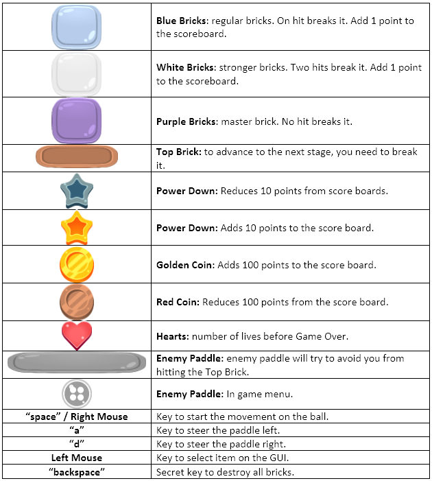

GitHubLogo.png?Style=centerme)

# MY BLOCK BREAKER - UNITY ENGINE PROJECT #

#######################################################################

- 420-JV8-AS - GAME ENGINE I

### Professor: ###

- Marc-Andre Larouche

### Development Team: ###

- Philipe Gouveia

#######################################################################

**Section 1: About the Game**

      This game is a type of blockbreaker with a tranquil atmosphere designed as first assignment for the course Game Engine I. This project was done during one week and is not totally complete. This game will be redesigned in the future to correct bugs and implement features that were not implemented on this version. 

**Section 2: About the Manual**

      2.1 - Important Visuals:
      

**Section 3: References**

*3.0 - Game Design*

 
bricks by CreativeGameAssets.com 
 
background and characters by Philipe Gouveia 
 
 
*3.1 - Programming*
 
by Philipe Gouveia 
 
*3.2 - Soung* 
 
piano music by ShadyDave - freesound.com 
 

*3.3 - Font*

 Heroes Legend by imagex Wanadoo at dafont.com